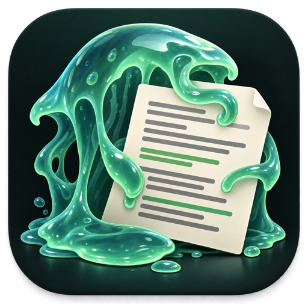

<p align="center">
  
</p>

<h1 align="center">ocre-jelly</h1>

Prose mode for Claude Code. It removes AI writing patterns from the text your agent writes and reviews: docs, READMEs, commit bodies, PR descriptions, tickets, code comments, doc comments and UI strings.

- **Prose authority per language:** ASD-STE100 for English, and a French plain-language standard (ISO 24495-1, Français Rationalisé principles, OQLF usage).
- **Ubiquitous language:** the project's glossary is the vocabulary. Its Terms are protected, and aliases to avoid are flagged.
- **Locales:** regional spelling, terms and typography for en-US, en-GB, en-CA, en-AU, fr-CA, fr-FR, fr-BE and fr-CH.
- **Commit messages:** subject, body wrap, Conventional Commits or gitmoji, and the prose of the body, as a `commit-msg` hook that warns or blocks (`commits.enforce`).
- **Code docs:** JSDoc, TSDoc, Javadoc, KDoc, .NET XML docs, docstrings, godoc, rustdoc, Doxygen, PHPDoc, Swift and YARD, plus GhostDoc and other generated stubs. A gate proves that a doc rewrite changed only comments.
- **Modules:** 39 integrations and conventions you can switch on and off (ponytail, caveman, Conventional Commits, Conventional Comments, ADRs, Keep a Changelog, Vale, cspell, Cursor/Windsurf/Cline/Kiro/AGENTS.md exports, …).
- **Small context cost:** hooks inject a short core plus one index line per active module. The agent reads a module only when the work matches it.

**Full documentation: [docs/](docs/README.md).** It has a tutorial, how-to guides (team setup, glossary, locales, code docs, modules, tuning), the complete configuration reference and the writing standards.

Security posture: Python standard library only. No network access, no subprocesses, no transcript harvesting, no automatic PRs. The scanners read only stdin, the files you name and the ocre-jelly config files.

## Install

Requirements: Claude Code, Python 3.10 or later.

### For yourself (every repo)

```bash
claude plugin marketplace add https://git.nexapptech.com/vbernier/ocre-jelly.git
claude plugin install ocre-jelly@ocre-jelly
```

### For a team repo

Run this in the repo, then commit `.claude/settings.json`. Teammates are offered the plugin when they trust the folder.

```bash
claude plugin marketplace add https://git.nexapptech.com/vbernier/ocre-jelly.git --scope project
claude plugin install ocre-jelly@ocre-jelly --scope project
```

Then give the repo its settings, and commit `.claude/ocre-jelly.json`:

```bash
python3 ~/.claude/plugins/marketplaces/ocre-jelly/skills/ocre-jelly/scripts/modules.py config init --project
python3 ~/.claude/plugins/marketplaces/ocre-jelly/skills/ocre-jelly/scripts/modules.py config set locales '["en-CA","fr-CA"]' --project
```

Or ask Claude: "set ocre-jelly's locales to en-CA and fr-CA for this repo."

### From a clone

```bash
git clone https://git.nexapptech.com/vbernier/ocre-jelly.git
cd ocre-jelly
./setup.sh                  # user scope; --scope project|local also work
./setup.sh --check          # self-tests only
./setup.sh --uninstall
```

Restart Claude Code after you install.

## Use

```
/ocre-jelly audit README.md          flag AI tells, change nothing
/ocre-jelly rewrite docs/guide.md    minimal repairs, facts preserved
/ocre-jelly docs src/api/*.ts        audit or fix comments and doc comments
/ocre-jelly modules list             see which modules are on, and why
/ocre-jelly commit                   check the commit message you're about to use
/ocre-jelly config show              see the merged settings
```

With the plugin installed, the prose mode is always on. `OCRE_JELLY=off` disables it for a session, and "stop ocre-jelly" ends it in chat.

## Configure

One JSON shape, four layers. Later layers win:

| Layer | File | Commit it? |
|---|---|---|
| defaults | built in | |
| user | `~/.claude/ocre-jelly.json` | no |
| project | `<repo>/.claude/ocre-jelly.json` | yes, it's shared with the team |
| local | `<repo>/.claude/ocre-jelly.local.json` | no; `config set --local` adds it to `.git/info/exclude` |

```json
{
  "locales": ["en-CA", "fr-CA"],
  "glossary": "docs/ubiquitous-language.md",
  "modules": { "conventional-commits": "on", "ghostdoc": "on", "caveman": "off" },
  "inject": "index",
  "subagents": { "inject": true, "matcher": "writer|doc" },
  "thresholds": { "sentence_words": 25, "instruction_words": 20, "em_dash_per_paragraph": 3, "length_hits_per_file": 3 },
  "severity": { "em-dash": "off", "anglicism": "hard" },
  "ignore_paths": ["**/*.generated.cs", "vendor/*"],
  "protected_terms": ["MoFlex", "CMiC"],
  "commits": { "enforce": "block", "convention": "conventional", "subject_max": 72 }
}
```

`ocre-jelly.schema.json` describes every key. Point your editor at it for completion. Every key, default and layer is in [docs/reference/configuration.md](docs/reference/configuration.md).

## Ubiquitous language

ocre-jelly reads `docs/ubiquitous-language.md` or `UBIQUITOUS-LANGUAGE.md` (or the `glossary` path in the config). The file is a set of markdown tables, one per bounded context. Each table has a `Term` column and an `Aliases to avoid` column. A `UI label (fr-CA)` column is optional, and its words are valid too. When no glossary exists, the skill asks whether to create one as committed (`docs/`) or local only. The template is in `skills/ocre-jelly/references/UBIQUITOUS-LANGUAGE.template.md`.

## Extend

- **Module:** add `skills/ocre-jelly/modules/<name>.md` with frontmatter (`kind: rules|export`, `default: on|off|auto`, `detect` or `detect_files`, `when:`) and a body. An export module adds `target:`, and can have a `<name>.py` with `render(ctx)`.
- **Locale:** add `skills/ocre-jelly/locales/<lang>.py` (patterns, `STOPWORDS`, `AUTHORITY`) or `<lang>-<REGION>.py` (`PARENT`, `SUMMARY`, `SPELLING_STYLE`, `PREFER`, extra `SOFT`/`HARD`).
- Run `./setup.sh --check` after any change. Every module and locale is loaded and checked, and the generated reference pages must be current (`skills/ocre-jelly/scripts/gen_docs.py` rewrites them).
- Step-by-step guides: [Add a module](docs/how-to/add-a-module.md), [Add a locale](docs/how-to/add-a-locale.md).

## Layout

```
.claude-plugin/        plugin and marketplace manifests (hooks: SessionStart, SubagentStart)
assets/                brand icon: ocre-jelly.png (1254 px master), -512 (README), -128 (plugin icon)
skills/ocre-jelly/
  SKILL.md             the skill: audit, rewrite, docs, modules, config
  core-rules.md        the always-on rules injected by the hooks
  references/          STE100, French rules, patterns, code-doc conventions, glossary template
  modules/             39 switchable integrations and conventions
  locales/             en, fr and 8 regional variants
  scripts/             scan.py (prose), codedoc.py (comments and strings), commitmsg.py (commit messages), modules.py (modules, config, hooks), config.py, gen_docs.py
docs/                  user documentation (Diátaxis: tutorials, how-to, reference, explanation)
ocre-jelly.schema.json JSON Schema for the config
setup.sh               install, check, uninstall
.pre-commit-hooks.yaml the commit-msg hook for the pre-commit framework
```

## License

Proprietary. All rights reserved. See [LICENSE](LICENSE).
