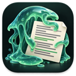

# ocre-jelly documentation

ocre-jelly is a prose mode for Claude Code. It finds and removes AI writing patterns in the text your agent writes: docs, READMEs, commit bodies, PR descriptions, tickets, code comments, doc comments and UI strings. It follows a written standard for each language, the project's ubiquitous language and the project's locales.

These docs follow [Diátaxis](https://diataxis.fr/): a tutorial to learn, how-to guides for tasks, reference for facts, and explanation for the reasons.

## Start here

- [Getting started](tutorials/getting-started.md): install ocre-jelly, run your first audit and rewrite, and set up one repo.

## How-to guides

| Task | Guide |
|---|---|
| Share ocre-jelly with a team through the repo | [Set up a team repo](how-to/set-up-a-team-repo.md) |
| Give the project one vocabulary | [Write a ubiquitous-language glossary](how-to/write-a-glossary.md) |
| Check spelling and terms for en-CA, fr-CA, fr-FR and others | [Configure locales](how-to/configure-locales.md) |
| Fix comments, doc comments and i18n strings | [Audit code docs and UI strings](how-to/audit-code-docs-and-ui-strings.md) |
| Turn integrations on or off, export rules to other tools | [Manage modules and exports](how-to/manage-modules-and-exports.md) |
| Reduce noise, raise or drop a check, skip paths | [Tune the checks](how-to/tune-checks.md) |
| Add support for a tool or convention | [Add a module](how-to/add-a-module.md) |
| Add a language or a regional variant | [Add a locale](how-to/add-a-locale.md) |
| Something doesn't work | [Troubleshoot](how-to/troubleshoot.md) |

## Reference

- [Configuration](reference/configuration.md): every key, its type and default, the layers, and the environment variables.
- [Command line](reference/cli.md): `scan.py`, `codedoc.py`, `modules.py`, `gen_docs.py` and `setup.sh`.
- [Checks](reference/checks.md): every finding category, its severity and its languages. *Generated.*
- [Modules](reference/modules.md): all 38 modules, their defaults and triggers. *Generated.*
- [Locales](reference/locales.md): the 10 locales and what each one checks. *Generated.*
- [Glossary format](reference/glossary-format.md): the table shape the parser reads.

## Explanation

- [The ocre-jelly writing standards](explanation/standards.md): what counts as a defect, what is protected, and the English and French rules.
- [Design](explanation/design.md): progressive disclosure, hooks, config layers, the security posture, and how ocre-jelly shares work with ponytail, caveman and other tools.
